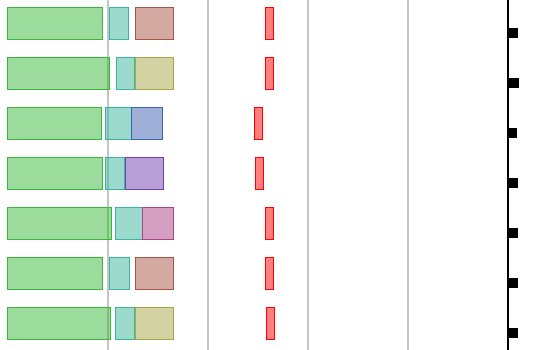

# `timing-analyzer` script

The `timing-analyzer` script provides a web-based visualization of VBus traffic timing.


## Usage

To start the `timing-analyzer` script add both the `webserver` and the `timing-analyzer` script to your resol-vbus-toolbox options:

```
❯ bin/resol-vbus-toolbox <... connection options ...> --script scripts/webserver.js --script scripts/timing-analyzer.js
[scripts/webserver.js] Webserver running on port 3000...
[scripts/webserver.js] - http://127.0.0.1:3000/
[scripts/webserver.js] - http://[::1]:3000/
...
```

This starts the webserver on port 3000 by default and prints a list of URLs where the webserver is accessible.
The web interface of the `timing-analyzer` script can be accessed under the `/timing-analyzer/` directory. For example the local IPv4 URL would be:

    http://127.0.0.1:3000/timing-analyzer/

Opening that URL in a webbrowser will show each incoming VBus packet and datagram as a colored block on the timeline:



The example above shows:

- time "flows" from left to right and from top to bottom
- vertical rulers in black and grey along the time line
    - black rulers every second
    - grey rulers every 200 ms
- colored blocks for each packet and datagram
    - width corresponds to the transit time on the VBus
    - colors can be customized, but a basic color scheme is provided without configuration
- black square marks the end of a communication cycle
    - communication continues in the next line at the left border


### VBus connection considerations

Since the timing information is later added by the resol-vbus-toolbox on reception, different connection types have different influences on the timing. The preferred connection types (in order of preference) are:

1. using a VBus/USB adapter and the `--path <serial port name>` connection option for most reliable timing information,
2. using a VBus/TCP device (like a DL2 Plus) over a wired network connection, and
3. using a VBus/TCP device over a wireless network connection.


## Planned features

- tooltips to get additional information about the blocks
- controls to pause, resume and reset recording
